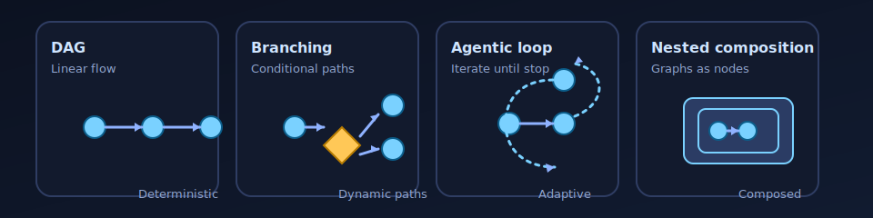

# hypergraph

A unified framework for Python workflow orchestration. DAG pipelines, agentic workflows, and everything in between.

- **Unified** - One framework for data pipelines and agentic AI. Same elegant code.
- **Hierarchical** - Graphs nest as nodes. Build big from small, tested pieces.
- **Versatile** - Sync, async, streaming. Branches, loops, human-in-the-loop. No limits.
- **Minimal** - No state schemas. No boilerplate. Just functions.



## Installation

```bash
uv add hypergraph-ai
# or 
pip install hypergraph-ai
```

> **Alpha**: Core node types and graph construction are working. Runners and control flow are in progress.

## Quick Start

Define functions. Name their outputs. hypergraph connects them automatically.

```python
from hypergraph import Graph, node

@node(output_name="embedding")
def embed(text: str) -> list[float]:
    return model.embed(text)

@node(output_name="docs")
def retrieve(embedding: list[float]) -> list[str]:
    return db.search(embedding)

@node(output_name="answer")
def generate(docs: list[str], query: str) -> str:
    return llm.generate(docs, query)

# Edges inferred from names - no wiring needed
graph = Graph(nodes=[embed, retrieve, generate])
```

`embed` produces `embedding`. `retrieve` takes `embedding`. Connected automatically.

<!-- TODO: simple-dag.svg - 3-node RAG pipeline: embed → retrieve → generate -->

## Progressive Examples

### 1. Simple Pipeline (DAG)

The RAG example above is a classic DAG - data flows in one direction. No special annotations needed.

```python
# Linear flow: clean → transform → save
pipeline = Graph(nodes=[clean, transform, save])

# Check what the graph needs
print(pipeline.input_spec)
# InputSpec(required={'raw_data'}, optional={'config'}, ...)
```

### 2. Branching

Route execution based on conditions.

```python
from hypergraph import branch

@branch(when_true="fast_path", when_false="full_rag")
def check_cache(query: str) -> bool:
    return query in cache

graph = Graph(nodes=[check_cache, fast_path, full_rag, merge])
```

<!-- TODO: branch-node.svg - Diamond decision node with two paths -->

### 3. Agentic Loops

Multi-turn conversations, iterative refinement, agent workflows - define when to loop, when to stop.

```python
from hypergraph import route, END

@node(output_name="response")
async def generate(docs: list, messages: list) -> str:
    async for chunk in llm.stream(docs, messages):
        yield chunk

@node(output_name="messages")
def accumulate(messages: list, response: str) -> list:
    return messages + [{"role": "assistant", "content": response}]

@route(targets=["retrieve", END])
def should_continue(messages: list) -> str:
    if len(messages) > 10:
        return END
    return "retrieve"

graph = Graph(nodes=[retrieve, generate, accumulate, should_continue])
```

The graph loops back to `retrieve` until `should_continue` returns `END`.

<!-- TODO: cyclic-graph.svg - Agentic loop with END node -->

### 4. Hierarchical Composition

Graphs are nodes. Test pieces independently. Reuse across workflows.

```python
# Inner graph: RAG pipeline
rag = Graph(nodes=[embed, retrieve, generate], name="rag")

# Outer graph: full workflow
workflow = Graph(nodes=[
    validate_input,
    rag.as_node(),      # Nested graph as a node
    format_output,
])
```

Each nested graph runs to completion before the outer graph continues. Test the RAG pipeline alone, then compose it into larger workflows.

<!-- TODO: nested-collapsed.svg - Graph shown as single node -->
<!-- TODO: nested-expanded.svg - Same graph expanded to show internals -->

### 5. Multi-Agent Orchestration

Build agent teams by composing graphs. Each agent is a graph. The orchestrator is a graph of agents.

```python
# Each agent is its own graph
researcher = Graph(nodes=[search, analyze, summarize], name="researcher")
writer = Graph(nodes=[draft, refine, format], name="writer")
reviewer = Graph(nodes=[check_facts, check_style, score], name="reviewer")

# Agents as nodes with a review loop
@route(targets=["writer", END])
def review_gate(score: float) -> str:
    return END if score > 0.9 else "writer"

team = Graph(nodes=[
    researcher.as_node(),
    writer.as_node(),
    reviewer.as_node(),
    review_gate,
])
```

<!-- TODO: multi-agent.svg - Three agent nodes with review loop -->

### 6. Rename and Adapt

Same function, different contexts. Same graph, different interfaces.

```python
# Original node
@node(output_name="embedding")
def embed(text: str) -> list[float]: ...

# Adapt for different contexts
query_embed = embed.with_inputs(text="query").with_outputs(embedding="query_vec")
doc_embed = embed.with_inputs(text="document").with_outputs(embedding="doc_vec")

# Same graph, different interfaces
rag_for_search = rag.as_node().with_inputs(query="search_query")
rag_for_chat = rag.as_node().with_inputs(query="user_message")
```

### 7. Think Singular, Scale with Map

Write logic for one item. Scale to many with map.

```python
# Write for one document
@node(output_name="features")
def extract(document: str) -> dict:
    return analyze(document)

# Scale to many
results = runner.map(graph, values={"document": documents}, map_over="document")
```

## Why Hypergraph?

### The Problem: Fragmented Tools

| Tool | Strength | Limitation |
|------|----------|------------|
| Hamilton, Pipefunc | Clean DAG pipelines | No agentic patterns, no loops |
| LangGraph, Pydantic-Graph | Agents, multi-turn | Boilerplate, state schemas, no dynamic graphs |

DAG frameworks can't handle agents. Agent frameworks have too much ceremony. You shouldn't need different tools for data pipelines and agentic AI.

### The Solution: One Unified Framework

Hypergraph spans the full spectrum - from batch data pipelines to multi-turn AI agents - with the same minimal API.

**Pure Functions Stay Pure**

```python
# Test without the framework
def test_embed():
    result = embed.func("hello")
    assert len(result) == 768
```

Your functions are just functions. No state objects to mock. No framework setup.

**Build-Time Validation**

```python
@route(targets=["step_a", "step_b", END])
def decide(x: int) -> str:
    return "step_c"  # Typo

graph = Graph(nodes=[decide, step_a, step_b])
# GraphValidationError: Route target 'step_c' not found.
# Valid targets: ['step_a', 'step_b', 'END']
# Did you mean 'step_a'?
```

Typos, missing connections, dead ends - caught when you build the graph, not buried in a stack trace at 2am.

**Outputs ARE State**

No state schema to define. No reducers. No conflicts. Node outputs flow between nodes automatically.

```python
# embed produces "embedding"
# retrieve consumes "embedding", produces "docs"
# generate consumes "docs", produces "answer"
# That's the entire state model.
```

## Design Principles

1. **Pure functions** - Nodes are testable without the framework
2. **Composition over configuration** - Nest graphs, don't configure flags
3. **Unified execution** - Same algorithm for DAGs, branches, and loops
4. **Fail fast** - Validate at build time, not runtime
5. **Explicit dependencies** - All inputs visible in function signatures

## What's Implemented

**Working now:**
- `@node` decorator for wrapping functions (sync, async, generators)
- `Graph` construction with automatic edge inference
- `InputSpec` categorization (required, optional, bound, internal)
- Rename API (`.with_inputs()`, `.with_outputs()`, `.with_name()`)
- Hierarchical composition (`.as_node()`)
- Build-time validation with helpful error messages

**Coming soon:**
- Runners (`SyncRunner`, `AsyncRunner`)
- Control flow (`@route`, `@branch`)
- Checkpointing and durability
- Event streaming and observability
- `InterruptNode` for human-in-the-loop

## Beyond AI/ML

> **Note**: While the examples above focus on AI/ML use cases, hypergraph is a general-purpose workflow framework. It has no dependencies on LLMs, vector databases, or any AI tooling. Use it for any multi-step workflow: ETL pipelines, business process automation, testing harnesses, or anything else that benefits from graph-based orchestration.

## Documentation

- [Getting Started](docs/getting-started.md) - Core concepts and first steps
- [Philosophy](docs/philosophy.md) - Why hypergraph exists
- [API Reference](docs/api/nodes.md) - Complete node documentation

For a detailed comparison with LangGraph, Hamilton, and other frameworks, see [COMPARISON.md](docs/comparison.md).

## License

MIT
