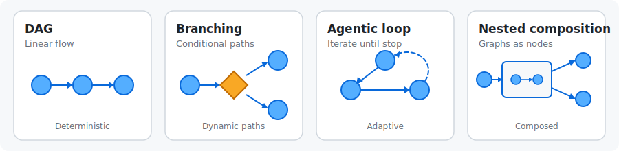

<p align="center">
  <picture>
    <source media="(prefers-color-scheme: dark)" srcset="assets/hypergraph-white-text.png">
    <source media="(prefers-color-scheme: light)" srcset="assets/hypergraph-dark-text.png">
    
  </picture>
</p>

<div align="center">
  <a href="https://gilad-rubin.gitbook.io/hypergraph"><strong>Docs</strong></a> ·
  <a href="https://github.com/gilad-rubin/hypergraph/issues/new"><strong>Report Bug</strong></a> ·
  <a href="https://github.com/gilad-rubin/hypergraph/issues/new"><strong>Feature Request</strong></a> ·
  <a href="https://gilad-rubin.gitbook.io/hypergraph/getting-started/comparison"><strong>Comparison</strong></a>
</div>

<br>

<p align="center">
  <a href="https://deepwiki.com/gilad-rubin/hypergraph"></a>
  <a href="LICENSE"></a>
</p>

A unified framework for Python workflow orchestration. DAG pipelines, agentic workflows, and everything in between.

- **Unified** - One framework for data pipelines and agentic AI. Same elegant code.
- **Hierarchical** - Graphs nest as nodes. Build big from small, tested pieces.
- **Versatile** - Sync, async, streaming. Branches, loops, human-in-the-loop. No limits.
- **Minimal** - No state schemas. No boilerplate. Just functions.

<picture>
  <source media="(prefers-color-scheme: dark)" srcset="docs/spectrum-dark.svg">
  <source media="(prefers-color-scheme: light)" srcset="docs/spectrum-light.svg">
  
</picture>

## Installation

```bash
uv add git+https://github.com/gilad-rubin/hypergraph.git
# or
pip install git+https://github.com/gilad-rubin/hypergraph.git
```

> **Alpha**: API may change between releases. Core features are stable — nodes, graphs, runners, routing, and cyclic graphs.

## Quick Start

Define functions. Name their outputs. hypergraph connects them automatically.

```python
from hypergraph import Graph, node, SyncRunner

@node(output_name="embedding")
def embed(text: str) -> list[float]:
    return model.embed(text)

@node(output_name="docs")
def retrieve(embedding: list[float]) -> list[str]:
    return db.search(embedding)

@node(output_name="answer")
def generate(docs: list[str], query: str) -> str:
    return llm.generate(docs, query)

# Edges inferred from names - no wiring needed
graph = Graph(nodes=[embed, retrieve, generate])

# Run the graph
runner = SyncRunner()
result = runner.run(graph, {"text": "RAG tutorial", "query": "What is RAG?"})
print(result["answer"])
```

`embed` produces `embedding`. `retrieve` takes `embedding`. Connected automatically.

## Examples

### Branching

Route execution based on conditions.

```python
from hypergraph import ifelse

@ifelse(when_true="fast_path", when_false="full_rag")
def check_cache(query: str) -> bool:
    return query in cache

graph = Graph(nodes=[check_cache, fast_path, full_rag, merge])
```

### Agentic Loops

Multi-turn conversations, iterative refinement, agent workflows — define when to loop, when to stop.

```python
from hypergraph import route, END

@node(output_name="response")
async def generate(docs: list, messages: list) -> str:
    async for chunk in llm.stream(docs, messages):
        yield chunk

@node(output_name="messages")
def accumulate(messages: list, response: str) -> list:
    return messages + [{"role": "assistant", "content": response}]

@route(targets=["retrieve", END])
def should_continue(messages: list) -> str:
    if len(messages) > 10:
        return END
    return "retrieve"

graph = Graph(nodes=[retrieve, generate, accumulate, should_continue])
```

The graph loops back to `retrieve` until `should_continue` returns `END`.

### Hierarchical Composition

Graphs are nodes. Test pieces independently. Reuse across workflows.

```python
# Inner graph: RAG pipeline
rag = Graph(nodes=[embed, retrieve, generate], name="rag")

# Outer graph: full workflow
workflow = Graph(nodes=[
    validate_input,
    rag.as_node(),      # Nested graph as a node
    format_output,
])
```

Each nested graph runs to completion before the outer graph continues. Test the RAG pipeline alone, then compose it into larger workflows.

### Human-in-the-Loop

Pause execution for user input. Resume with a response.

```python
from hypergraph import AsyncRunner, Graph, InterruptNode, node

approval = InterruptNode(
    name="approval",
    input_param="draft",
    output_param="decision",
)

graph = Graph(nodes=[generate_draft, approval, finalize])
runner = AsyncRunner()

result = await runner.run(graph, {"prompt": "Write a blog post"})
# result.paused == True, result.pause.value has the draft

result = await runner.run(graph, {
    "prompt": "Write a blog post",
    result.pause.response_key: "approved",
})
# Completed!
```

See the docs for more patterns: [multi-agent orchestration](https://gilad-rubin.gitbook.io/hypergraph/patterns/05-multi-agent), [rename & adapt](docs/05-how-to/rename-and-adapt.md), [batch processing with map](https://gilad-rubin.gitbook.io/hypergraph/how-to-guides/batch-processing), [streaming](docs/03-patterns/06-streaming.md), and [caching](docs/03-patterns/08-caching.md).

## Key Features

### Graph Introspection

```python
# What does a graph need?
print(graph.input_spec)
# InputSpec(required={'text', 'query'}, optional={'config'}, seed={'messages'})

# Pre-fill inputs for reuse
configured = graph.bind(model="gpt-4", temperature=0.7)

# Return only specific outputs
focused = graph.select("answer", "confidence")

# Enable build-time type checking across node boundaries
graph = Graph(nodes=[...], strict_types=True)
```

### Build-Time Validation

Typos, missing connections, dead ends — caught when you build the graph, not at runtime.

```python
@route(targets=["step_a", "step_b", END])
def decide(x: int) -> str:
    return "step_c"  # Typo

graph = Graph(nodes=[decide, step_a, step_b])
# GraphValidationError: Route target 'step_c' not found.
# Valid targets: ['step_a', 'step_b', 'END']
# Did you mean 'step_a'?
```

### Pure Functions Stay Pure

```python
# Test without the framework
def test_embed():
    result = embed.func("hello")
    assert len(result) == 768
```

Your functions are just functions. No state objects to mock. No framework setup.

## Why Hypergraph?

DAG frameworks can't handle agents. Agent frameworks have too much ceremony. You shouldn't need different tools for data pipelines and agentic AI.

Hypergraph spans the full spectrum — from batch data pipelines to multi-turn AI agents — with the same minimal API. See how it [compares to other frameworks](https://gilad-rubin.gitbook.io/hypergraph/getting-started/comparison).

## Design Principles

1. **Pure functions** - Nodes are testable without the framework
2. **Composition over configuration** - Nest graphs, don't configure flags
3. **Unified execution** - Same algorithm for DAGs, branches, and loops
4. **Fail fast** - Validate at build time, not runtime
5. **Explicit dependencies** - All inputs visible in function signatures

## Beyond AI/ML

> **Note**: While the examples above focus on AI/ML use cases, hypergraph is a general-purpose workflow framework. It has no dependencies on LLMs, vector databases, or any AI tooling. Use it for any multi-step workflow: ETL pipelines, business process automation, testing harnesses, or anything else that benefits from graph-based orchestration.

## Documentation

- [Getting Started](https://gilad-rubin.gitbook.io/hypergraph/core-concepts/getting-started) - Core concepts and first steps
- [Routing Guide](https://gilad-rubin.gitbook.io/hypergraph/patterns/02-routing) - Conditional routing, agentic loops, and real-world patterns
- [Philosophy](https://gilad-rubin.gitbook.io/hypergraph/design/philosophy) - Why hypergraph exists
- [API Reference: Nodes](https://gilad-rubin.gitbook.io/hypergraph/api-reference/nodes) - FunctionNode, GraphNode, and HyperNode
- [API Reference: Runners](https://gilad-rubin.gitbook.io/hypergraph/api-reference/runners) - SyncRunner, AsyncRunner, and execution model
- [API Reference: Events](https://gilad-rubin.gitbook.io/hypergraph/api-reference/events) - Event types, processors, and RichProgressProcessor
- [API Reference: Graph](https://gilad-rubin.gitbook.io/hypergraph/api-reference/graph) - Graph construction and validation
- [API Reference: Gates](https://gilad-rubin.gitbook.io/hypergraph/api-reference/gates) - RouteNode, @route decorator, and END sentinel
- [Observe Execution](https://gilad-rubin.gitbook.io/hypergraph/how-to-guides/observe-execution) - Progress bars and custom event processors
- [Human-in-the-Loop](docs/03-patterns/07-human-in-the-loop.md) - InterruptNode, pause/resume, and handler patterns
- [Caching](docs/03-patterns/08-caching.md) - In-memory and disk caching for node results

## License

MIT
