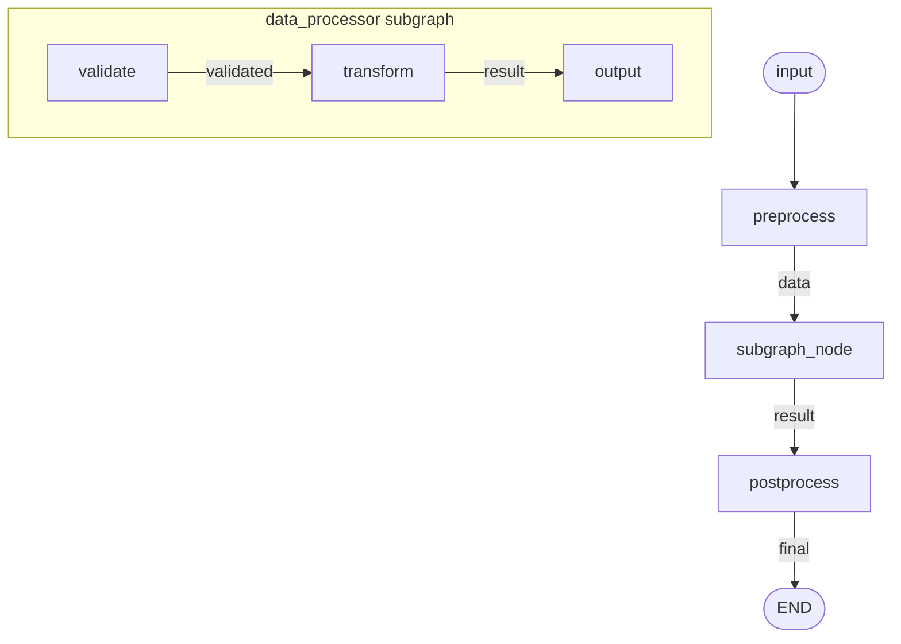
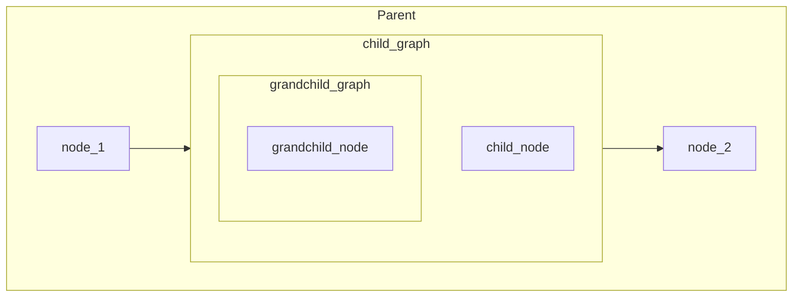

# Subgraphs

Using graphs as nodes within other graphs for modularity, reuse, and multi-agent systems.

**Source:** https://docs.langchain.com/oss/python/langgraph/use-subgraphs

## Why Subgraphs?

Subgraphs are useful for:

- **Multi-agent systems** — each agent is a graph with its own internal logic
- **Reusability** — share common workflows across multiple parent graphs
- **Team distribution** — different teams work on different subgraphs independently
- **Encapsulation** — hide implementation details, expose clean interfaces

## Basic Pattern: `.as_node()`

Wrap any graph as a node in another graph:



## Implementation

```python
from hypergraph import node, Graph, Runner


# --- Inner Graph (Subgraph) ---

@node(output_name="validated")
def validate(data: str) -> str:
    """Validate input data."""
    if not data.strip():
        raise ValueError("Empty data")
    return data.strip().upper()


@node(output_name="result")
def transform(validated: str) -> str:
    """Transform validated data."""
    return f"Processed: {validated}"


data_processor = Graph(
    nodes=[validate, transform],
    name="data_processor",
)


# --- Outer Graph (Parent) ---

@node(output_name="data")
def preprocess(input: str) -> str:
    """Prepare input for processing."""
    return input.replace("_", " ")


@node(output_name="final")
def postprocess(result: str) -> str:
    """Finalize the result."""
    return f"✓ {result}"


# --- Build Parent Graph ---

pipeline = Graph(
    nodes=[
        preprocess,
        data_processor.as_node(),  # Subgraph wrapped as node
        postprocess,
    ],
    name="pipeline",
)


# --- Run ---

if __name__ == "__main__":
    runner = Runner()
    result = runner.run(
        pipeline,
        inputs={"input": "hello_world"},
    )
    print(result["final"])  # "✓ Processed: HELLO WORLD"
```

## Execution Flow

| Step | Node | Output |
|------|------|--------|
| 1 | `preprocess` | `data` = "hello world" |
| 2 | `data_processor.validate` | `validated` = "HELLO WORLD" |
| 2 | `data_processor.transform` | `result` = "Processed: HELLO WORLD" |
| 3 | `postprocess` | `final` = "✓ Processed: HELLO WORLD" |

## Key Patterns

### Pattern 1: Direct Composition (Shared Names)

When subgraph input/output names match what the parent produces/consumes:

```python
# Subgraph expects 'data', produces 'result'
@node(output_name="result")
def process(data: str) -> str: ...

subgraph = Graph(nodes=[process], name="subgraph")

# Parent produces 'data', consumes 'result' — names align!
parent = Graph(
    nodes=[
        preprocess,           # produces 'data'
        subgraph.as_node(),   # consumes 'data', produces 'result'
        postprocess,          # consumes 'result'
    ],
    name="parent",
)
```

### Pattern 2: Input Mapping (`.with_inputs()`)

When subgraph parameter names differ from parent output names:

```python
# Subgraph expects 'text', but parent produces 'raw_input'
@node(output_name="cleaned")
def clean(text: str) -> str: ...

cleaner = Graph(nodes=[clean], name="cleaner")

parent = Graph(
    nodes=[
        extract,  # produces 'raw_input'
        cleaner.as_node()
            .with_inputs(text="raw_input"),  # Map 'raw_input' → 'text'
        format_output,
    ],
    name="parent",
)
```

### Pattern 3: Iteration (`.map_over()`)

Run subgraph once per item in a list (see also [05-Orchestrator-Worker](05-orchestrator-worker.md)):

```python
# Subgraph processes ONE item
@node(output_name="processed")
def process_item(item: str) -> str: ...

item_processor = Graph(nodes=[process_item], name="item_processor")

parent = Graph(
    nodes=[
        get_items,  # produces 'items' (a list)
        item_processor.as_node()
            .with_inputs(item="items")  # Connect list to single-item param
            .map_over("items"),         # Iterate over each item (parallel)
        combine_results,
    ],
    name="parent",
)
```

## Multi-Level Subgraphs

Subgraphs can contain subgraphs — compose arbitrarily deep:



```python
# Grandchild graph
@node(output_name="gc_result")
def grandchild_node(gc_input: str) -> str:
    return f"gc({gc_input})"

grandchild = Graph(nodes=[grandchild_node], name="grandchild")


# Child graph (contains grandchild)
@node(output_name="child_result")
def child_node(child_input: str) -> str:
    return f"child({child_input})"

child = Graph(
    nodes=[
        child_node,
        grandchild.as_node()
            .with_inputs(gc_input="child_result"),
    ],
    name="child",
)


# Parent graph (contains child)
@node(output_name="output")
def node_1(input: str) -> str:
    return f"node1({input})"

@node(output_name="final")
def node_2(gc_result: str) -> str:
    return f"node2({gc_result})"

parent = Graph(
    nodes=[
        node_1,
        child.as_node()
            .with_inputs(child_input="output"),
        node_2,
    ],
    name="parent",
)

# Result: "node2(gc(child(node1(hello))))"
```

## Subgraph with Different Schema

When subgraph has completely different parameter names, use `.with_inputs()` and `.with_outputs()` to bridge:

```python
# Subgraph uses internal naming: 'bar' → 'baz'
@node(output_name="baz")
def internal_process(bar: str) -> str:
    return bar.upper()

subgraph = Graph(nodes=[internal_process], name="subgraph")

# Parent uses external naming: 'foo' → 'result'
parent = Graph(
    nodes=[
        prepare,  # produces 'foo'
        subgraph.as_node()
            .with_inputs(bar="foo")      # Map parent's 'foo' → subgraph's 'bar'
            .with_outputs(result="baz"), # Map subgraph's 'baz' → parent's 'result'
        finalize,  # consumes 'result'
    ],
    name="parent",
)
```

## Multi-Agent Example

Common pattern for multi-agent systems — each agent is a subgraph:

```python
from hypergraph import node, route, Graph, AsyncRunner

# --- Agent 1: Researcher ---

@node(output_name="research")
async def search(query: str) -> str:
    """Search for information."""
    return f"Found info about: {query}"

@node(output_name="summary")
async def summarize(research: str) -> str:
    """Summarize research."""
    return f"Summary: {research[:50]}..."

researcher = Graph(
    nodes=[search, summarize],
    name="researcher",
)


# --- Agent 2: Writer ---

@node(output_name="draft")
async def write_draft(summary: str, topic: str) -> str:
    """Write initial draft."""
    return f"Draft about {topic}: {summary}"

@node(output_name="polished")
async def polish(draft: str) -> str:
    """Polish the draft."""
    return f"[Polished] {draft}"

writer = Graph(
    nodes=[write_draft, polish],
    name="writer",
)


# --- Orchestrator ---

@node(output_name="query")
def create_query(topic: str) -> str:
    """Create search query from topic."""
    return f"latest research on {topic}"

orchestrator = Graph(
    nodes=[
        create_query,
        researcher.as_node()
            .with_inputs(query="query"),
        writer.as_node()
            .with_inputs(summary="summary", topic="topic"),
    ],
    name="orchestrator",
)


async def main():
    runner = AsyncRunner()
    result = await runner.run(
        orchestrator,
        inputs={"topic": "AI agents"},
    )
    print(result["polished"])
```

## LangGraph Comparison

| LangGraph | hypergraph |
|-----------|------------|
| `subgraph_builder.compile()` then `add_node("name", subgraph)` | `subgraph.as_node()` |
| Wrapper function to transform state | `.with_inputs()` / `.with_outputs()` |
| `builder.add_node("name", call_subgraph)` | Direct: `subgraph.as_node()` in nodes list |
| `checkpointer` propagates to subgraphs | Runner handles persistence consistently |
| `stream_mode="updates", subgraphs=True` | Streaming includes all nested graphs automatically |
| Shared state via `TypedDict` keys | Shared names flow naturally between graphs |

## Key Takeaways

1. **`.as_node()`** — wraps a graph as a node
2. **`.with_inputs(inner="outer")`** — maps outer names to inner parameters
3. **`.with_outputs(outer="inner")`** — maps inner outputs to outer names
4. **`.map_over("param")`** — iterates subgraph over a list (parallel)
5. **Composition is recursive** — subgraphs can contain subgraphs
6. **No state transformation code** — declarative mapping, not wrapper functions
