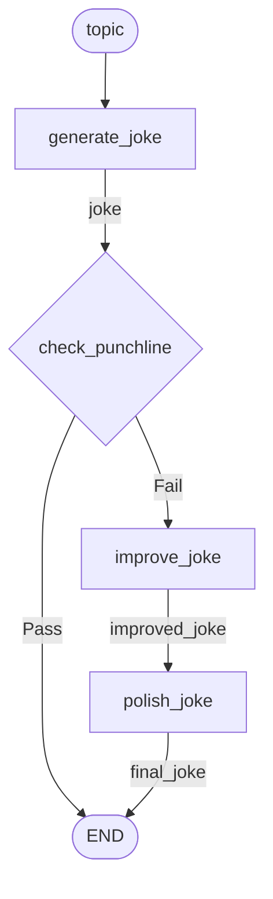

# Prompt Chaining

Sequential LLM calls where each processes the output of the previous, with a gate to optionally skip steps.

**Source:** https://docs.langchain.com/oss/python/langgraph/workflows-agents#prompt-chaining

## Graph Structure



## Implementation

```python
import asyncio
from hypergraph import node, branch, Graph, END, AsyncRunner
from langchain_anthropic import ChatAnthropic

llm = ChatAnthropic(model="claude-sonnet-4-5-20250929")


# --- Nodes ---

@node(output_name="joke")
async def generate_joke(topic: str) -> str:
    """First LLM call: generate initial joke."""
    msg = await llm.ainvoke(f"Write a short joke about {topic}")
    return msg.content


@branch(when_true=END, when_false="improve_joke")
def check_punchline(joke: str) -> bool:
    """Gate: does the joke have a punchline?"""
    return "?" in joke or "!" in joke


@node(output_name="improved_joke")
async def improve_joke(joke: str) -> str:
    """Second LLM call: add wordplay."""
    msg = await llm.ainvoke(f"Make this joke funnier by adding wordplay: {joke}")
    return msg.content


@node(output_name="final_joke")
async def polish_joke(improved_joke: str) -> str:
    """Third LLM call: add surprising twist."""
    msg = await llm.ainvoke(f"Add a surprising twist to this joke: {improved_joke}")
    return msg.content


# --- Build Graph ---

prompt_chain = Graph(
    nodes=[generate_joke, check_punchline, improve_joke, polish_joke],
    name="joke_chain",
)


# --- Run ---

async def main():
    runner = AsyncRunner()
    result = await runner.run(prompt_chain, inputs={"topic": "cats"})

    print("Initial joke:")
    print(result["joke"])

    if "improved_joke" in result:
        print("\nImproved joke:")
        print(result["improved_joke"])
        print("\nFinal joke:")
        print(result["final_joke"])
    else:
        print("\nJoke passed! No improvement needed.")


if __name__ == "__main__":
    asyncio.run(main())
```

## Execution Flow

**Path A: Joke passes the gate**

| Step | Node | Output |
|------|------|--------|
| 1 | `generate_joke` | `joke` = "Why did the cat...?" |
| 2 | `check_punchline` | True (has "?") → END |

**Path B: Joke fails the gate**

| Step | Node | Output |
|------|------|--------|
| 1 | `generate_joke` | `joke` = "Cats are funny" |
| 2 | `check_punchline` | False (no "?" or "!") → `improve_joke` |
| 3 | `improve_joke` | `improved_joke` = "Cats are purrfectly funny..." |
| 4 | `polish_joke` | `final_joke` = "Cats are purrfectly funny... plot twist!" |

## Key Pattern: Early Exit with @branch

The `@branch` decorator allows early termination:

```python
@branch(when_true=END, when_false="improve_joke")
def check_punchline(joke: str) -> bool:
    """If joke is good enough, skip the improvement steps."""
    return "?" in joke or "!" in joke
```

- **True** → routes to `END` (skip remaining nodes)
- **False** → routes to `improve_joke` (continue chain)

## LangGraph Comparison

| LangGraph | hypergraph |
|-----------|------------|
| `add_conditional_edges("generate_joke", check_punchline, {"Fail": "improve_joke", "Pass": END})` | `@branch(when_true=END, when_false="improve_joke")` |
| Explicit edge from `improve_joke` to `polish_joke` | Implicit: `polish_joke` consumes `improved_joke` |
| State dict with all fields | Each node declares only what it needs |
