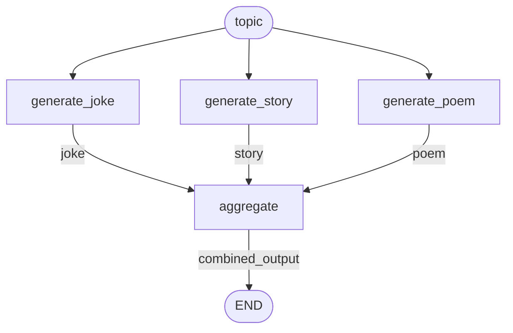

# Parallelization

Multiple LLM calls run simultaneously, then aggregate results. HyperNodes handles this naturally - nodes run when their inputs are available.

**Source:** https://docs.langchain.com/oss/python/langgraph/workflows-agents#parallelization

## Graph Structure



## Implementation

```python
import asyncio
from hypernodes import node, Graph, AsyncRunner
from langchain_anthropic import ChatAnthropic

llm = ChatAnthropic(model="claude-sonnet-4-5-20250929")


# --- Parallel Nodes (all consume 'topic') ---

@node(output_name="joke")
async def generate_joke(topic: str) -> str:
    """Generate a joke about the topic."""
    msg = await llm.ainvoke(f"Write a joke about {topic}")
    return msg.content


@node(output_name="story")
async def generate_story(topic: str) -> str:
    """Generate a story about the topic."""
    msg = await llm.ainvoke(f"Write a short story about {topic}")
    return msg.content


@node(output_name="poem")
async def generate_poem(topic: str) -> str:
    """Generate a poem about the topic."""
    msg = await llm.ainvoke(f"Write a poem about {topic}")
    return msg.content


# --- Aggregator (waits for all parallel outputs) ---

@node(output_name="combined_output")
async def aggregate(topic: str, joke: str, story: str, poem: str) -> str:
    """Combine all outputs into final result."""
    return f"""Here's a joke, story, and poem about {topic}!

JOKE:
{joke}

STORY:
{story}

POEM:
{poem}"""


# --- Build Graph ---

parallel_graph = Graph(
    nodes=[generate_joke, generate_story, generate_poem, aggregate],
    name="parallel_content",
)


# --- Run ---

async def main():
    runner = AsyncRunner()
    result = await runner.run(parallel_graph, inputs={"topic": "cats"})
    print(result["combined_output"])


if __name__ == "__main__":
    asyncio.run(main())
```

## Execution Flow

| Tick | Nodes Running | Outputs |
|------|---------------|---------|
| 1 | `generate_joke`, `generate_story`, `generate_poem` (parallel) | `joke`, `story`, `poem` |
| 2 | `aggregate` (waits for all three) | `combined_output` |

All three generators run in parallel because:
- They all consume `topic` (available immediately)
- They have no dependencies on each other

`aggregate` waits automatically because it needs `joke`, `story`, and `poem`.

## Key Pattern: Implicit Parallelism

**No explicit parallel edges needed.** The graph structure determines parallelism:

```python
# These three nodes all consume 'topic' → run in parallel
@node(output_name="joke")
async def generate_joke(topic: str): ...

@node(output_name="story")
async def generate_story(topic: str): ...

@node(output_name="poem")
async def generate_poem(topic: str): ...

# This node consumes all three outputs → waits for all
@node(output_name="combined_output")
async def aggregate(topic: str, joke: str, story: str, poem: str): ...
```

## LangGraph Comparison

**LangGraph requires explicit parallel edges:**
```python
# Must explicitly wire fan-out
builder.add_edge(START, "call_llm_1")
builder.add_edge(START, "call_llm_2")
builder.add_edge(START, "call_llm_3")

# Must explicitly wire fan-in
builder.add_edge("call_llm_1", "aggregator")
builder.add_edge("call_llm_2", "aggregator")
builder.add_edge("call_llm_3", "aggregator")
```

**HyperNodes - edges are implicit:**
```python
# Just declare the nodes - edges derived from parameter names
Graph(nodes=[generate_joke, generate_story, generate_poem, aggregate])
```

| LangGraph | HyperNodes |
|-----------|------------|
| 6 explicit `add_edge()` calls | 0 explicit edges |
| Must manually wire START to each parallel node | Automatic: all nodes consuming input run |
| Must manually wire each parallel node to aggregator | Automatic: aggregator waits for its parameters |
