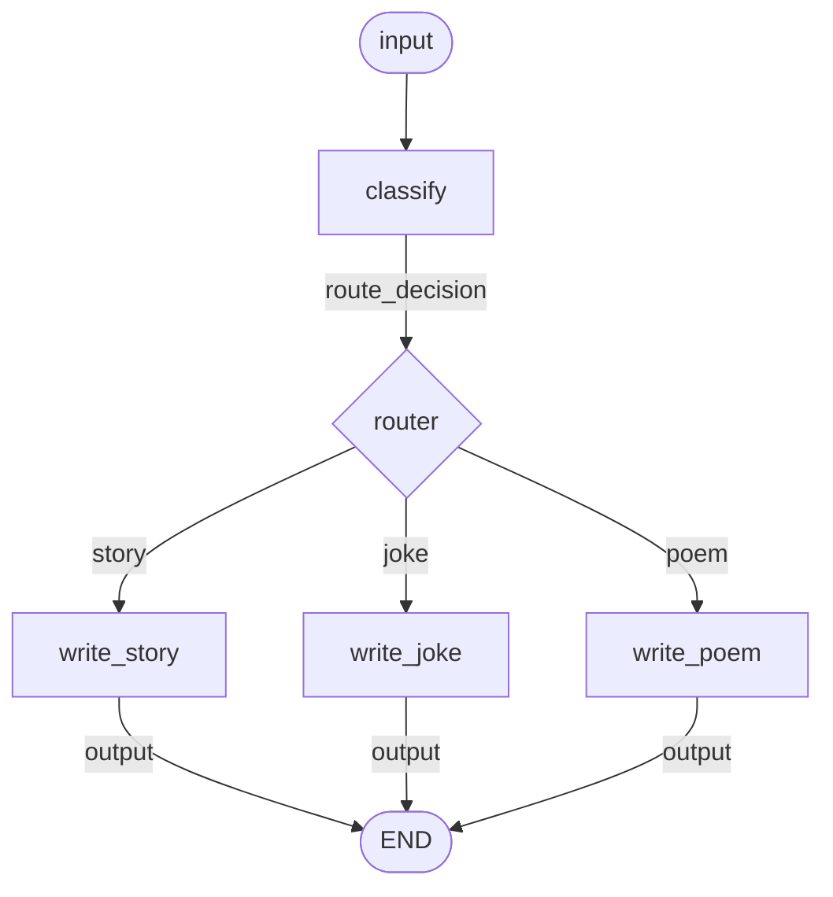

# Routing

Route inputs to specialized handlers based on LLM classification. Uses `@route` for multi-way branching (more than 2 paths).

**Source:** https://docs.langchain.com/oss/python/langgraph/workflows-agents#routing

## Graph Structure



## Implementation

```python
import asyncio
from hypernodes import node, route, Graph, AsyncRunner
from langchain_anthropic import ChatAnthropic
from langchain.messages import SystemMessage, HumanMessage
from pydantic import BaseModel, Field
from typing import Literal

llm = ChatAnthropic(model="claude-sonnet-4-5-20250929")


# --- Schema for structured routing ---

class Route(BaseModel):
    step: Literal["poem", "story", "joke"] = Field(
        description="The type of content to generate"
    )


router_llm = llm.with_structured_output(Route)


# --- Nodes ---

@node(output_name="route_decision")
async def classify(input: str) -> str:
    """LLM classifies the input to determine routing."""
    decision = await router_llm.ainvoke([
        SystemMessage(content="Route the input to story, joke, or poem based on the user's request."),
        HumanMessage(content=input),
    ])
    return decision.step


@route(targets=["write_story", "write_joke", "write_poem"])
def router(route_decision: str) -> str:
    """Route to the appropriate content generator."""
    return f"write_{route_decision}"


@node(output_name="output")
async def write_story(input: str) -> str:
    """Generate a story."""
    msg = await llm.ainvoke(f"Write a short story based on: {input}")
    return msg.content


@node(output_name="output")
async def write_joke(input: str) -> str:
    """Generate a joke."""
    msg = await llm.ainvoke(f"Write a joke based on: {input}")
    return msg.content


@node(output_name="output")
async def write_poem(input: str) -> str:
    """Generate a poem."""
    msg = await llm.ainvoke(f"Write a poem based on: {input}")
    return msg.content


# --- Build Graph ---

routing_graph = Graph(
    nodes=[classify, router, write_story, write_joke, write_poem],
    name="content_router",
)


# --- Run ---

async def main():
    runner = AsyncRunner()

    # Test different inputs using .map()
    inputs = [
        "Write me a joke about cats",
        "Tell me a story about a brave knight",
        "I want a poem about the ocean",
    ]

    results = await runner.map(
        routing_graph,
        inputs={"input": inputs},
        map_over="input",
    )

    for result in results:
        print(f"Input: {result["input"]}")
        print(f"Output: {result['output'][:100]}...")
        print("---")


if __name__ == "__main__":
    asyncio.run(main())
```

## Execution Flow

With `.map()`, all three inputs run in parallel, each following its own route:

| Input | Route Decision | Handler |
|-------|----------------|---------|
| "Write me a joke about cats" | joke | `write_joke` |
| "Tell me a story about a brave knight" | story | `write_story` |
| "I want a poem about the ocean" | poem | `write_poem` |

Only the routed handler runs for each input - the other two are skipped.

## Key Patterns

### @route vs @branch

| Decorator | Paths | Returns |
|-----------|-------|---------|
| `@branch` | 2 (binary) | `bool` |
| `@route` | 3+ (multi-way) | `str` (node name) |

```python
# @route - return target node name directly
@route(targets=["write_story", "write_joke", "write_poem"])
def router(route_decision: str) -> str:
    return f"write_{route_decision}"
```

### Mutually Exclusive Producers

Multiple nodes can output the same name if they're on exclusive paths:

```python
@node(output_name="output")
async def write_story(input: str) -> str: ...

@node(output_name="output")  # Same output name - OK!
async def write_joke(input: str) -> str: ...

@node(output_name="output")  # Same output name - OK!
async def write_poem(input: str) -> str: ...
```

### Batch with .map()

```python
results = await runner.map(graph, inputs={"input": [...]}, map_over="input")
```

## LangGraph Comparison

| LangGraph | HyperNodes |
|-----------|------------|
| `add_conditional_edges(src, fn, {mapping})` | `@route(targets=[...])` |
| Explicit `add_edge(handler, END)` × 3 | Implicit termination |
| `for x in items: graph.invoke(...)` | `runner.map(..., map_over=...)` |
