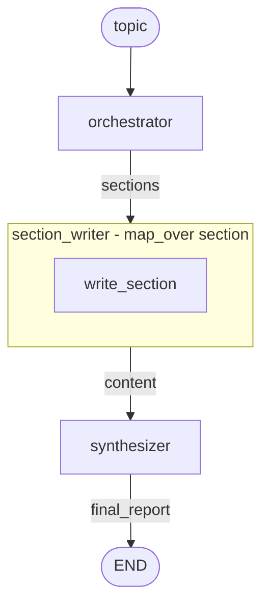

# Orchestrator-Worker

Dynamic task breakdown: an orchestrator plans subtasks, workers execute them in parallel, then results are synthesized.

**Source:** https://docs.langchain.com/oss/python/langgraph/workflows-agents#orchestrator-worker

## Graph Structure



## Implementation

```python
import asyncio
from hypernodes import node, Graph, AsyncRunner
from langchain_anthropic import ChatAnthropic
from langchain.messages import SystemMessage, HumanMessage
from pydantic import BaseModel, Field

llm = ChatAnthropic(model="claude-sonnet-4-5-20250929")


# --- Schema for planning ---

class Section(BaseModel):
    name: str = Field(description="Section name")
    description: str = Field(description="What this section should cover")


class Sections(BaseModel):
    sections: list[Section] = Field(description="Sections of the report")


planner = llm.with_structured_output(Sections)


# --- Inner Graph: Process ONE section ---

@node(output_name="content")
async def write_section(section: Section) -> str:
    """Write a single section."""
    msg = await llm.ainvoke([
        SystemMessage(content="Write a report section. Use markdown formatting."),
        HumanMessage(content=f"Section: {section.name}\nDescription: {section.description}"),
    ])
    return msg.content


section_writer = Graph(nodes=[write_section], name="section_writer")


# --- Outer Graph Nodes ---

@node(output_name="sections")
async def orchestrator(topic: str) -> list[Section]:
    """Plan the report structure."""
    result = await planner.ainvoke([
        SystemMessage(content="Generate a plan for the report with 3-5 sections."),
        HumanMessage(content=f"Topic: {topic}"),
    ])
    return result.sections


@node(output_name="final_report")
async def synthesizer(content: list[str]) -> str:
    """Combine sections into final report."""
    return "\n\n---\n\n".join(content)


# --- Build Outer Graph ---

report_generator = Graph(
    nodes=[
        orchestrator,
        section_writer.as_node()
            .with_inputs(section="sections")  # Map outer 'sections' → inner 'section'
            .map_over("sections"),             # Iterate over each section
        synthesizer,
    ],
    name="report_generator",
)


# --- Run ---

async def main():
    runner = AsyncRunner()
    result = await runner.run(
        report_generator,
        inputs={"topic": "LLM scaling laws"},
    )
    print(result["final_report"])


if __name__ == "__main__":
    asyncio.run(main())
```

## Execution Flow

| Step | Node | Output |
|------|------|--------|
| 1 | `orchestrator` | `sections` = [Section("Intro"), Section("Methods"), ...] |
| 2 | `section_writer` | runs `write_section` for each item (parallel) → `content` = ["...", "..."] |
| 3 | `synthesizer` | `final_report` = combined markdown |

## Key Pattern: .with_inputs().map_over()

Transform a single-item graph into a batch processor:

```python
# Inner graph processes ONE section
section_writer = Graph(nodes=[write_section], name="section_writer")

# Wrap as node, map input, iterate
section_writer.as_node()
    .with_inputs(section="sections")  # Connect outer 'sections' to inner 'section'
    .map_over("section")              # Iterate over the list
```

**What happens:**
1. `orchestrator` produces `sections` (a list)
2. `.with_inputs(section="sections")` connects this list to the inner graph's `section` parameter
3. `.map_over("sections")` iterates: runs `write_section` for each item (in parallel)
4. Results collected into `content` (a list)

## LangGraph Comparison

| LangGraph | HyperNodes |
|-----------|------------|
| `Send` API for dynamic workers | `.with_inputs().map_over()` |
| Separate worker state class | Same graph, automatic iteration |
| `Annotated[list, operator.add]` for collecting | Results collected automatically |
| Manual worker dispatch logic | Declarative chaining |
