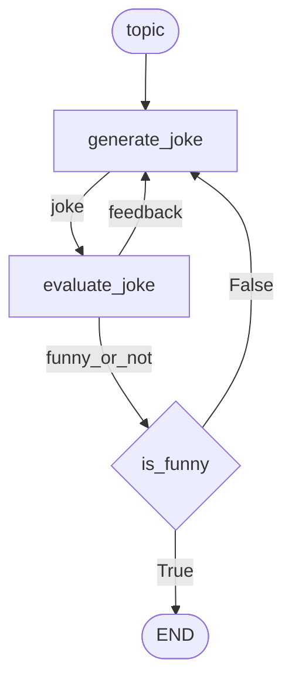

# Evaluator-Optimizer

A feedback loop where one LLM generates content and another evaluates it. The loop continues until the evaluator accepts the output.

**Source:** https://docs.langchain.com/oss/python/langgraph/workflows-agents#evaluator-optimizer

## Graph Structure



## Implementation

```python
import asyncio
from hypernodes import node, branch, Graph, END, AsyncRunner
from langchain_anthropic import ChatAnthropic
from pydantic import BaseModel, Field
from typing import Literal

llm = ChatAnthropic(model="claude-sonnet-4-5-20250929")


# --- Schema for structured evaluation ---

class Feedback(BaseModel):
    grade: Literal["funny", "not funny"] = Field(
        description="Decide if the joke is funny or not."
    )
    feedback: str = Field(
        description="If the joke is not funny, provide feedback on how to improve it."
    )


evaluator_llm = llm.with_structured_output(Feedback)


# --- Nodes ---

@node(output_name="joke")
async def generate_joke(topic: str, feedback: str | None) -> str:
    """Generate a joke. First call: feedback=None. Subsequent: from evaluator."""
    prompt = f"Write a joke about {topic}"
    if feedback:
        prompt += f". Take into account this feedback: {feedback}"
    msg = await llm.ainvoke(prompt)
    return msg.content


@node(output_name=("funny_or_not", "feedback"))
async def evaluate_joke(joke: str) -> tuple[str, str]:
    """Evaluate the joke and provide feedback."""
    result = await evaluator_llm.ainvoke(f"Grade this joke: {joke}")
    return result.grade, result.feedback


@branch(when_true=END, when_false="generate_joke")
def is_funny(funny_or_not: str) -> bool:
    """Route based on evaluation result."""
    return funny_or_not == "funny"


# --- Build Graph ---

optimizer = Graph(
    nodes=[generate_joke, evaluate_joke, is_funny],
    name="joke_optimizer",
).bind(feedback=None)  # Provide initial value for the cycle


# --- Run ---

async def main():
    runner = AsyncRunner()
    result = await runner.run(
        optimizer,
        inputs={"topic": "cats"},
    )
    print(f"Final joke: {result['joke']}")


if __name__ == "__main__":
    asyncio.run(main())
```

## Execution Flow

The graph loops until the evaluator is satisfied:

| Iteration | Node | Output |
|-----------|------|--------|
| 1 | `generate_joke` | `joke` = "Why did the cat sit on the computer?" (uses bound `feedback=None`) |
| 1 | `evaluate_joke` | `funny_or_not` = "not funny", `feedback` = "Needs a punchline" |
| 1 | `is_funny` | False → loop back |
| 2 | `generate_joke` | `joke` = "Why did the cat sit on the computer? To keep an eye on the mouse!" |
| 2 | `evaluate_joke` | `funny_or_not` = "funny", `feedback` = "" |
| 2 | `is_funny` | True → END |

## Key Pattern: `.bind()` for Cycle Initialization

When a parameter has an incoming edge, **its function default is ignored** (Edge Cancels Default rule). Use `.bind()` to provide the initial value.

### The Problem

```python
@node(output_name="joke")
async def generate_joke(topic: str, feedback: str | None) -> str:
    # feedback has an edge from evaluate_joke
    # → any default would be IGNORED
    # → need to provide initial value somehow
    ...
```

### The Solution: `.bind()`

Use `.bind()` to set default values for graph inputs:

```python
optimizer = Graph(
    nodes=[generate_joke, evaluate_joke, is_funny],
    name="joke_optimizer",
).bind(feedback=None)  # Provide initial value for the cycle
```

**Why it works:**
1. `.bind(feedback=None)` sets the initial value for `feedback`
2. `generate_joke` can run immediately with `feedback=None`
3. On loop back, `evaluate_joke` produces new `feedback` (overrides bound value)
4. Clean, declarative - no extra nodes needed

### Input is Simple

```python
runner.run(graph, inputs={"topic": "cats"})  # Just the topic!
```

The `.bind()` encapsulates the cycle setup - caller doesn't need to know about `feedback`.

## Multiple Outputs

Use a tuple for `output_name` when a node produces multiple values:

```python
@node(output_name=("funny_or_not", "feedback"))
async def evaluate_joke(joke: str) -> tuple[str, str]:
    return grade, feedback_text
```

## LangGraph Comparison

| LangGraph | HyperNodes |
|-----------|------------|
| `state.get("feedback")` check | `.bind(feedback=None)` |
| Implicit state initialization | Explicit: `.bind()` for defaults |
| `add_conditional_edges(...)` | `@branch(when_true=END, when_false="generate_joke")` |
| State accumulates all fields | Only produced values flow forward |
