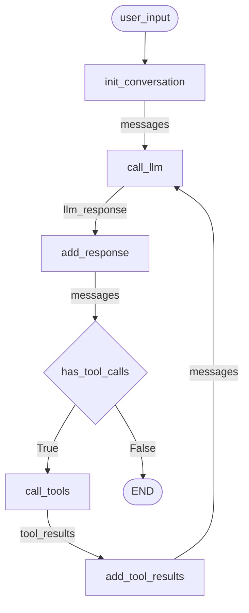

# Agents

Autonomous tool-calling agents that operate in continuous feedback loops, deciding which tools to use and when to stop.

**Source:** https://docs.langchain.com/oss/python/langgraph/workflows-agents#agents

**Note:** This is the same pattern as [01-Calculator Agent](01-calculator-agent.md), demonstrating it's a general-purpose agent architecture.

## Graph Structure



## Implementation

```python
import asyncio
from hypernodes import node, branch, Graph, END, AsyncRunner
from langchain_anthropic import ChatAnthropic
from langchain.tools import tool
from langchain.messages import SystemMessage, HumanMessage, ToolMessage, AIMessage

llm = ChatAnthropic(model="claude-sonnet-4-5-20250929")


# --- Tools ---

@tool
def multiply(a: int, b: int) -> int:
    """Multiply a and b."""
    return a * b


@tool
def add(a: int, b: int) -> int:
    """Add a and b."""
    return a + b


@tool
def divide(a: int, b: int) -> float:
    """Divide a by b."""
    return a / b


tools = [add, multiply, divide]
tools_by_name = {t.name: t for t in tools}
llm_with_tools = llm.bind_tools(tools)


# --- Nodes (6 total, single responsibility each) ---

@node(output_name="messages")
def init_conversation(user_input: str) -> list:
    """Create initial conversation with system prompt."""
    return [
        SystemMessage(content="You are a helpful assistant for arithmetic."),
        HumanMessage(content=user_input),
    ]


@node(output_name="llm_response")
async def call_llm(messages: list) -> AIMessage:
    """Call LLM with conversation history."""
    return await llm_with_tools.ainvoke(messages)


@node(output_name="messages")
async def add_response(messages: list, llm_response: AIMessage) -> list:
    """Add LLM response to conversation."""
    return messages + [llm_response]


@branch(when_true="call_tools", when_false=END)
def has_tool_calls(llm_response: AIMessage) -> bool:
    """Route: tools needed or done?"""
    return bool(llm_response.tool_calls)


@node(output_name="tool_results")
async def call_tools(llm_response: AIMessage) -> list[ToolMessage]:
    """Execute tool calls from LLM response."""
    results = []
    for tc in llm_response.tool_calls:
        result = tools_by_name[tc["name"]].invoke(tc["args"])
        results.append(ToolMessage(content=str(result), tool_call_id=tc["id"]))
    return results


@node(output_name="messages")
async def add_tool_results(messages: list, tool_results: list) -> list:
    """Add tool results to conversation. Creates cycle back to call_llm."""
    return messages + [*tool_results]


# --- Build Graph ---

agent = Graph(
    nodes=[init_conversation, call_llm, add_response, has_tool_calls, call_tools, add_tool_results],
    name="arithmetic_agent",
)


# --- Run ---

async def main():
    runner = AsyncRunner()
    result = await runner.run(
        agent,
        inputs={"user_input": "Add 3 and 4, then multiply by 2"},
    )

    for msg in result["messages"]:
        if hasattr(msg, "pretty_print"):
            msg.pretty_print()
        else:
            print(msg)


if __name__ == "__main__":
    asyncio.run(main())
```

## Execution Flow

| Tick | Node | Output |
|------|------|--------|
| 0 | `init_conversation` | `messages` v0 = [System, Human] |
| 1 | `call_llm` | `llm_response` = AI(tool_calls=[add(3,4)]) |
| 1 | `add_response` | `messages` v1 = [System, Human, AI] |
| 1 | `has_tool_calls` | True → route to `call_tools` |
| 1 | `call_tools` | `tool_results` = [Tool("7")] |
| 1 | `add_tool_results` | `messages` v2 = [System, Human, AI, Tool] |
| 2 | `call_llm` | `llm_response` = AI(tool_calls=[multiply(7,2)]) |
| 2 | `add_response` | `messages` v3 = [System, Human, AI, Tool, AI] |
| 2 | `has_tool_calls` | True → route to `call_tools` |
| 2 | `call_tools` | `tool_results` = [Tool("14")] |
| 2 | `add_tool_results` | `messages` v4 = [..., Tool] |
| 3 | `call_llm` | `llm_response` = AI("The result is 14") |
| 3 | `add_response` | `messages` v5 = [..., AI] |
| 3 | `has_tool_calls` | False → END |

## Key Patterns

### Single Responsibility

Each node does exactly one thing:

| Node | Responsibility |
|------|----------------|
| `init_conversation` | Create initial messages with system prompt |
| `call_llm` | Call the model |
| `add_response` | Accumulate response |
| `has_tool_calls` | Routing decision |
| `call_tools` | Execute tools |
| `add_tool_results` | Accumulate results |

### Initialization Node

System prompt is encapsulated in the graph, not the caller:

```python
@node(output_name="messages")
def init_conversation(user_input: str) -> list:
    return [
        SystemMessage(content="You are a helpful assistant."),
        HumanMessage(content=user_input),
    ]

# Caller just provides user input
runner.run(graph, inputs={"user_input": "Add 3 and 4"})
```

### Explicit Accumulation

No magic `operator.add` annotations. Accumulation is visible:

```python
@node(output_name="messages")
async def add_response(messages: list, llm_response: AIMessage) -> list:
    return messages + [llm_response]
```

### Cycle via Output Name

`add_tool_results` outputs `messages` → triggers `call_llm` (which consumes `messages`)

### Gates for Control Flow

No `if` statements inside nodes. Use `@branch` for routing:

```python
@branch(when_true="call_tools", when_false=END)
def has_tool_calls(llm_response: AIMessage) -> bool:
    return bool(llm_response.tool_calls)
```

## LangGraph Comparison

| LangGraph | HyperNodes |
|-----------|------------|
| `MessagesState` with `Annotated[list, operator.add]` | Explicit accumulator nodes |
| `should_continue` returns node name or END | `@branch(when_true=..., when_false=END)` |
| `add_edge("tool_node", "llm_call")` | Implicit: output name matches input parameter |
| Single `llm_call` node with append | Separate `call_llm` + `add_response` |
| Single `tool_node` with append | Separate `call_tools` + `add_tool_results` |
